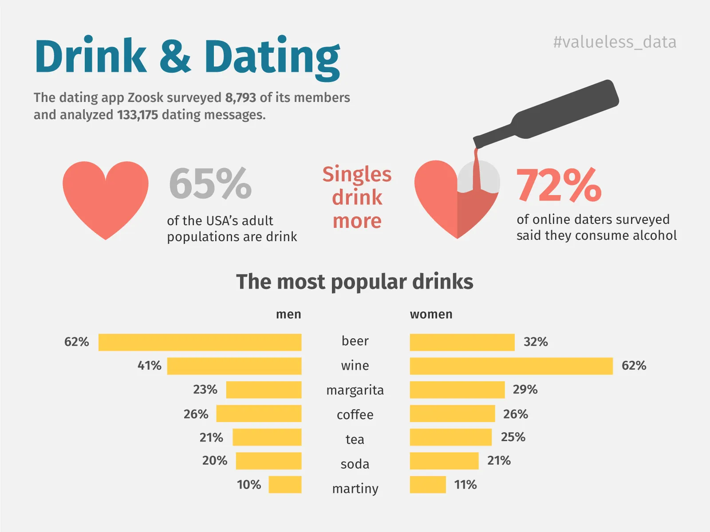
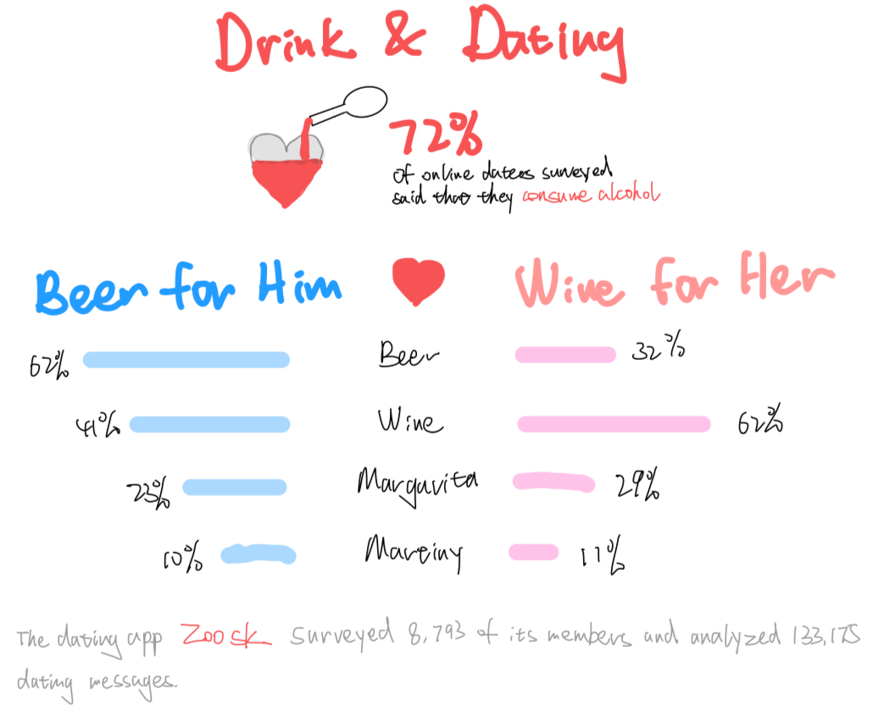

| [home page](https://https://nikki-lemon.github.io/nikki-chen-portfolio) | [data viz examples](dataviz-examples) | [critique by design](critique-by-design) | [final project I](final-project-part-one) | [final project II](final-project-part-two) | [final project III](final-project-part-three) |

# **Drink & Dating: Critique & Redesign**

## **Step one: the visualization**

**Original visualization (from Dribbble):**

I selected this visualization because it contains multiple layers of information about drinking behaviors and dating. The design is visually striking — especially the heart-shaped graphics — but the message is somewhat unclear, which makes it a good candidate for critique and redesign. I was also interested in how gender, alcohol, and dating preferences were being portrayed, and whether the visualization communicated these elements effectively.

Source: https://dribbble.com/shots/10539609-Drink-and-Dating-Infographics

---

## **Step two: the critique**

### **What the Original Does Well**

The two hearts for the drinking percentage stood out to me. By looking at them I quickly understand that single USA adults drink more. Although the sizing can be a bit out of proportion (the 72% area is smaller than the 65% area), it expresses the idea clearly and interestingly. The visualization did well on completeness, intuitiveness, and aesthetics. It includes all relevant data, I can easily understand the information in the text and graphs, and it is visually interesting, especially the two hearts for the percentages.

### **What the Original Does Not Do Well**

The visualization didn’t do well on usefulness. It contains too much information, so I can’t grasp the point easily. When I look at the bar graphs, I only see that men prefer beer and women prefer wine. This single piece of information lacks context and is unrelated to the central story of “singles drinking more.”

### **Audience and Effectiveness**

The primary audience is people who care about the relationship between drinking and dating — perhaps online daters who want to improve their dating experience or people who want to start dating. I think it is effective in reaching the audience because it grasps their attention easily with the titles “Drink & Dating” and “The most popular drinks.” However, for this audience the “Singles drink more” story may feel irrelevant, and the audience may also find the bar chart messy.

### **How I Would Improve It**

I will focus on making more sense of the bar chart. I will also try removing some information so that the visualization tells one story more effectively. Unifying the colors may also help.

---

## **Step three: Sketch a solution**

### **Redesign Focus**

The original graph has too much data and lacks focus. I choose only to show the percentage of drinking daters and what alcoholic drinks each gender prefers. I get rid of the data of the drinking US population and the percentage of daters who drink non-alcoholic drinks. This also changes the story to:  
a. a lot of daters drink, and  
b. beer is popular among men and wine is popular among women.

### **Color and Style Choices**

I simplify the colors and use blue and pink for men and women. The subtitle is changed to a grey footnote to reduce visual noise and keep the chart cleaner.

---

## **Step four: Test the solution**

### **Interview Results**

Interviewee 1, online dater in mid 20’s: the major takeaway is clear but feels like a stereotype, in most dates people drink non-alcoholic drinks; the color is good.  
Interviewee 2, grad student at Carnegie Mellon University: bar charts may not be the most effective way, try dot plot with dots of 2 colors; most people like coffee; the redesign is more focused than the original version.

---

### **Interview Table**

| **Question** | **Interview 1** | **Interview 2** |
|--------------|------------------|------------------|
| Can you tell me what you think this is? | the major takeaway is clear but feels like a stereotype | redesign is more focused |
| What is this telling you? | people drink non-alcoholic drinks | most people like coffee |
| Surprising/confusing? | feels like a stereotype | bar charts may not be the most effective |
| Intended audience? | online daters | people interested in dating culture |
| Anything you would change? | color is good | try a dot plot |

---

### **Synthesis**

From the feedback, both interviewees pointed out that the original “beer for him / wine for her” framing felt stereotypical. They also emphasized that most early dates involve non-alcoholic drinks, and this insight was missing. One interviewee suggested switching to a dot plot to compare the genders more cleanly. Based on this, I removed the stereotype framing, reframed the story toward coffee and tea as shared preferences, and adopted the dot plot recommendation.

---

## **Step five: build the solution**

### **Final Redesign Explanation**

**Reframing the story to avoid stereotypes and reflect dating reality**

I removed the “beer for him / wine for her” framing because it reinforces gender stereotypes and oversimplifies the original data. Instead, I shifted the focus toward a more reliable and realistic insight: most people do not drink alcohol on their early dates, and both men and women show similar preferences for non-alcoholic drinks like coffee and tea.

**Applying the dot plot suggestion and adopting a clean color design**

I took the suggestion of using a dot plot, because it clearly compares men and women across each drink type and makes similarities and differences easy to see. I also went with the simplified color scheme, using pink for women and blue for men, which keeps the visual clean and intuitive.

### **Final Visualization**

*(Insert Datawrapper embed or screenshot below)*

<iframe title="Drink &amp;amp; Dating" aria-label="Dot Plot" id="datawrapper-chart-CNgEO" src="https://datawrapper.dwcdn.net/CNgEO/1/" scrolling="no" frameborder="0" style="width: 0; min-width: 100% !important; border: none;" height="288" data-external="1"></iframe>

---

## **References**

Original visualization: https://dribbble.com/shots/10539609-Drink-and-Dating-Infographics  
Dataset source: *(Insert if available)*  
Class materials: *Telling Stories With Data*, CMU  

